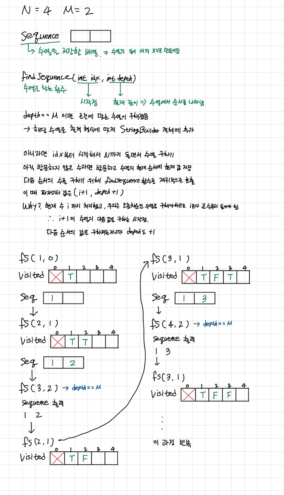

# [N과 M(2)](https://www.acmicpc.net/problem/15650)
## 문제
자연수 N과 M이 주어졌을 때 아래 조건을 만족하는 길이가 M인 수열 구하기
- 1부터 N까지 자연수 중에서 중복 없이 M개를 고른 수열
- 고른 수열은 오름차순이어야 함

## 입력
- N : 수열에 포함될 수 있는 수의 최대 값
- M : 수열의 길이 
- 1 <= M <= N <= 8
- N, M은 자연수

## 출력
- 한 줄에 하나씩 문제의 조건을 만족하는 수열 출력
- 중복되는 수열을 반복 출력하면 X
- 각 수열은 공백으로 구분해서 출력
- 수열은 사전 순으로 증가하는 순서로 출력

## 풀이
