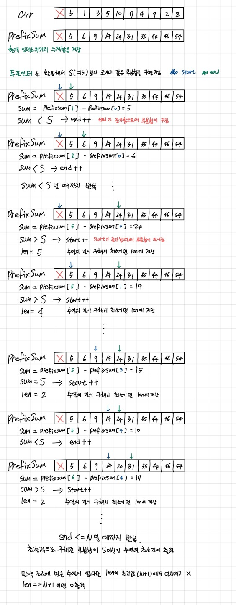

# [p1806 부분 합](https://www.acmicpc.net/problem/1806)
## 문제
- 1000이하의 자연수로 이루어진 길이 N짜리 수열이 주어짐
- 이 수열에서 연속된 수들의 부분합 중 그 합이 S이상이 되는 것 중 가장 짧은 것의 길이 구하기

## 입력
- N : 수열의 길이
- S : 구하려는 수열의 부분합 기준

## 출력
- 부분합이 S 이상인 수열 중에 가장 짧은 수열의 길이 출력
- 부분합을 S로 만드는 것이 불가능하다면 0 출력

## 풀이
